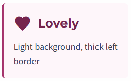
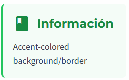
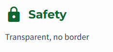
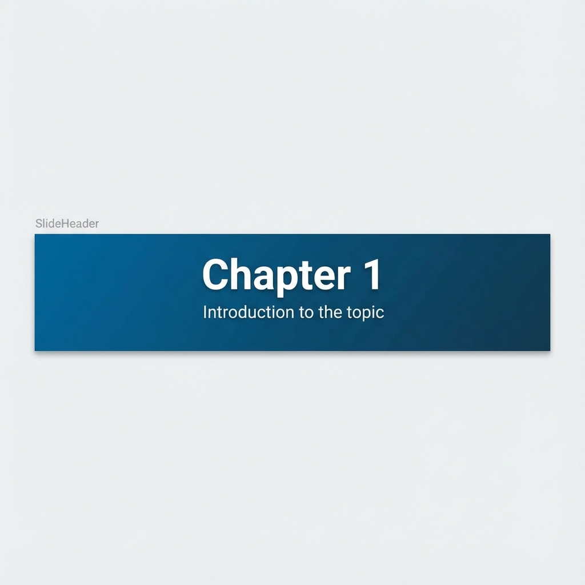
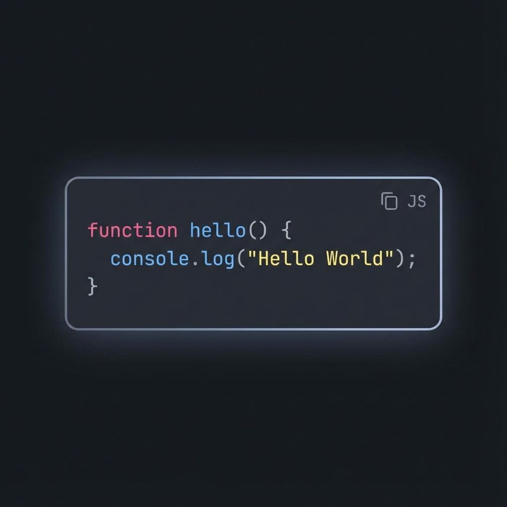

# Interactive academic presentation template

A React-based, fully responsive presentation engine designed for academic and technical contexts. This template combines the interactivity of a web application with the structured narrative of a slide deck, featuring a robust "App Shell" layout, reusable semantic components, and seamless mobile adaptation.

## Key features

### 🎨 Dynamic Theming & Colors
- **Real-time Color System**: Users can switch themes instantly (Blue, Purple, Orange, etc.) via a persistent palette menu.
- **Semantic Tokens**: Built on CSS variables (`--color-primary`, `--color-accent`), ensuring all components adapt automatically.
- **Monochromatic Consistency**: Accent elements automatically sync with the selected primary color for a polished look.
- **Dark Mode**: Native support with smooth transitions (`bg-slate-900` vs `bg-white`).
- **Persistence**: Preferences are saved to `localStorage` and restored on reload.

### ♿ Accessibility First (A11y)
- **Advanced Contrast Logic**: Uses **Relative Luminance** (WCAG standard) to dynamically calculate whether text should be black or white (`on-primary`) based on the selected background color.
- **Dark Mode Optimization**: Text shades automatically adjust (e.g., `primary-300` instead of `400`) to guarantee legibility against dark backgrounds.
- **Keyboard Navigation**: Fully navigable via keyboard (Tab, Arrows, Enter), including the color palette and slide controls.
- **Screen Readers**: Semantic HTML structure (`role="region"`, `aria-label`) for full JAWS/NVDA compatibility.
-   **Decorative Icons**: All decorative icons are marked with `aria-hidden="true"` to prevent visual noise for screen reader users.

## Creating a New Presentation

This project is designed to be a reusable template. For detailed instructions on how to use this repository as a scaffold for a new project, please refer to [SCAFFOLDING.md](./SCAFFOLDING.md).


### 🖥️ Modern "App Shell" Layout
The presentation uses a robust CSS-driven architecture:

-   **Responsive & stable**: Built on a fixed-height "App Shell" (`h-screen`) that ensures the navigation bar is always anchored to the bottom of the viewport ("Sticky Footer" pattern).
-   **Internal Scrolling**: Content overflows handled via internal scrolling within the slide card, ensuring the UI shell (navigation, background) remains stable.
-   **Sticky Headers**: Section headers remain fixed at the top of the view during scrolling, providing persistent context (`sticky top-0`).
-   **Fluid Desktop/Mobile**: Uses standard Tailwind CSS breakpoints (`lg:`) to switch between a focused mobile column layout and a spacious desktop "slide" view. No JavaScript scaling hacks required.

### 🧩 Component-Based Architecture
Slides are built using reusable, highly configurable components to ensure consistency and speed up development:
-   **`SlideLayout`**: Standardized wrapper handling spacing and responsiveness.
-   **`SlideHeader`**: Uniform gradient headers with title/subtitle support. Now supports sticky positioning.
-   **`IconCard`**: Versatile content cards with icon support and semantic variants (`info`, `warning`, `outlined`, `clean`).
-   **`CodeBlock`**: Code containers with dark mode support.
-   **`CallToAction`**: High-impact closing banners.

## Component Reference & Examples

### `IconCard`
The most versatile core component for displaying content blocks.

**Props:**
- `icon` (string): Material Icon name (optional)
- `title` (string): Card header
- `variant` (string): Visual style. Options:
  - `info` (default): Light background, thick left border
  - `warning`: Accent-colored background/border
  - `outlined-info`: Light background, thin primary border
  - `outlined-warning`: Light background, thin accent border
  - `clean`: Transparent, no border

**Example:**


```tsx
<IconCard icon="favorite" title="Lovely" variant="info">
  <p>Light background, thick left border.</p>
</IconCard>
```



```tsx
<IconCard icon="lightbulb" title="Key Concept" variant="warning">
  <p>Accent-colored background/border.</p>
</IconCard>
```


```tsx
<IconCard icon="lightbulb" title="Key Concept" variant="outlined-warning">
  <p>This is a highlighted concept box.</p>
</IconCard>
```


```tsx
<IconCard icon="lightbulb" title="Key Concept" variant="clean">
  <p>Transparent, no border.</p>
</IconCard>
```



### `SlideHeader`
Consistent title block that automatically handles the sticky positioning and gradient background.

**Props:**
- `title` (node): Main heading
- `subtitle` (node): Optional secondary text

**Example:**

```tsx
<SlideHeader
  title="Chapter 1"
  subtitle="Introduction to the topic"
/>
```



### `CodeBlock`
Syntax-highlighted container for code snippets. Supports dark mode automatically and includes a **"Copy to Clipboard"** button on hover.

**Example:**

```tsx
<CodeBlock>
{`function hello() {
  console.log("Hello World");
}`}
</CodeBlock>
```



### `CallToAction`
High-impact banner usually placed at the bottom of a slide.

**Props:**
- `text` (node): The main message
- `icon` (string): Optional icon (default: "rocket_launch")

**Example:**

```tsx
<CallToAction
            text="Aplica estos conceptos en tus proyectos académicos y comparte tus experiencias"
        />
```


## Technical Stack

-   **Framework**: [React 19](https://react.dev/) + [TypeScript](https://www.typescriptlang.org/)
-   **Build Tool**: [Vite](https://vitejs.dev/)
-   **Styling**: [Tailwind CSS](https://tailwindcss.com/)
-   **Icons**: [Material Icons](https://fonts.google.com/icons)

## Styles & Customization

The project utilizes a custom Tailwind configuration (`tailwind.config.js`) to enable dynamic theming:

-   **Semantic colors**: Use abstract color names instead of fixed utilities to support runtime theme switching.
    -   `bg-primary-700`: Main background tone (changes from Blue -> Purple -> Orange, etc.).
    -   `text-accent-500`: Highlighting color.
    -   `text-on-primary`: Dynamically calculated contrast color (white or black).
-   **Dark mode**: Implemented via the `class` strategy. Use `dark:` variants (e.g., `dark:bg-slate-900`) to define styles for the dark theme. Usage of `bg-white dark:bg-slate-900` is the standard pattern for containers.

## Project Structure

```bash
src/
├── App.tsx                 # App Shell: Main layout and navigation
├── main.tsx                # Entry point (Providers wrap App)
├── context/
│   └── ThemeContext.tsx    # Global state management for theming
├── hooks/
│   ├── useTheme.ts         # Hook to consume ThemeContext
│   └── useSlides.ts        # Slide navigation logic
├── components/
│   ├── Slides.tsx          # Registry: Main container that imports and renders slides
│   ├── slides/             # Individual Slide Components
│   │   ├── Portada.tsx
│   │   ├── Sesion1.tsx
│   │   └── ...
│   └── common/             # Reusable UI Kit
│       ├── SlideLayout.tsx # Standard page wrapper
│       ├── SlideHeader.tsx # Title/Subtitle component
│       ├── IconCard.tsx    # Content blocks with variants
│       ├── CodeBlock.tsx   # Code snippets with copy button
│       ├── CallToAction.tsx # Bottom banners
│       ├── MathBlock.tsx   # LaTeX rendering (KaTeX)
│       └── ImageBlock.tsx  # Optimized image container
└── index.css               # Global styles and Tailwind directives
```

## How to use as a template

### 1. Installation
Clone the repository and install dependencies:

```bash
npm install
npm run dev
```

### 2. Adding New Slides
1.  Create a new file in `src/components/slides/` (e.g., `MyNewSlide.tsx`).
2.  Build the component using the reusable primitives:
    ```tsx
    import SlideLayout from '../common/SlideLayout';
    import SlideHeader from '../common/SlideHeader';
    import IconCard from '../common/IconCard';

    const MyNewSlide = () => (
        <SlideLayout>
            <SlideHeader title="My Topic" subtitle="A subtitle here" />

            <div className="flex flex-col gap-6 px-16 py-12">
                <IconCard icon="lightbulb" title="Main Concept" variant="info">
                    Explanation of the concept...
                </IconCard>
            </div>
        </SlideLayout>
    );

    export default MyNewSlide;
    ```
3.  Import it in `src/components/Slides.tsx` and add it to the render logic.

### 3. Deployment
Build the project for production (generates static files in `dist/`):

```bash
npm run build
```

Deploy the `dist` folder to GitHub Pages, Vercel, or Netlify.

### 4. Customizing Colors
**Interactive Mode**: Click the **Palette Icon** (<i className="material-icons">palette</i>) in the navigation bar to open the color menu. Select any preset to instantly update the theme.

**Changing Defaults**: To modify the default colors used when the app first loads (before any user selection), edit `src/context/ThemeContext.tsx`:

```tsx
const [primaryColor, setPrimaryColor] = useState<string>(() => localStorage.getItem('primaryColor') || '#your-default-hex');
```

The application uses CSS variables and runtime palette generation to apply your choices globally without rebuilding.

## AI usage declaration

This presentation was developed with the assistance of artificial intelligence systems:

-   **GLM (ChatGLM4)**: Assistance in content structuring, slide design, and UX/UI improvement suggestions.
-   **Gemini**: Collaboration in JavaScript/CSS code generation, navigation system implementation, and accessibility optimization.

### AI role

-   Assistance in technical development (HTML, CSS, JavaScript)
-   Suggestions for content structure and organization
-   Code generation for reusable components
-   Proposals for functionality and design improvements

### Human responsibility

-   Selection and validation of all content
-   Critical editing and review of AI suggestions
-   Final decision-making regarding structure and design
-   Responsibility for the accuracy and quality of the final material
